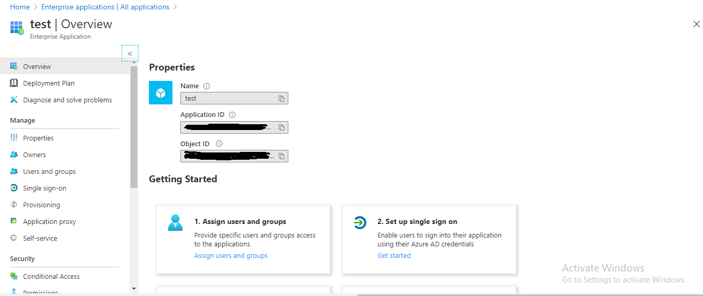
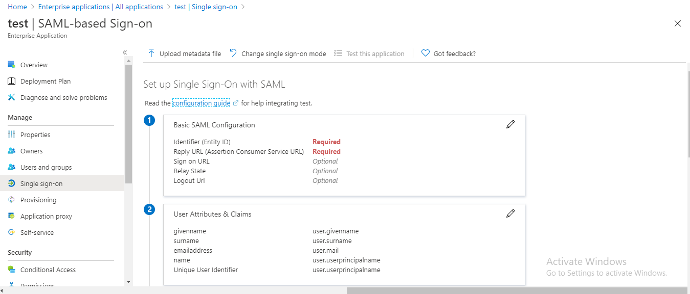
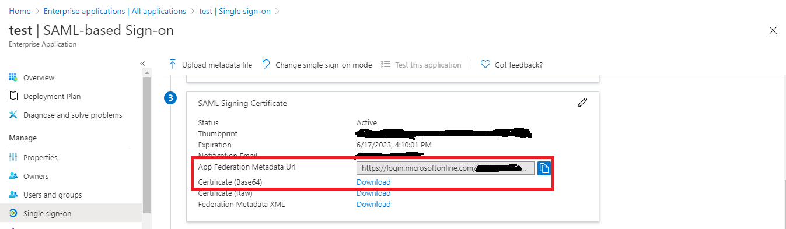

# saml-sso-and-slo-demo-idp-azure-sp-springboot
This project is to demonstrate the **Spring Boot SAML** 
integration with **Azure IDP**, so here this spring boot 
app behaves like **SP (Service Provider)** and the **IDP** 
will be the **Azure**.

### Requirements To Run Applications
* JDK 8 or later
* IDE (Optional)

### Dependencies And Tools Used To Build Applications
* Git
* JDK 8 or later
* Maven
* Spring Web
* Spring Security
* Spring SAML 2
* Spring Test
* Log4j2
* Thymeleaf
* IDE

### Prerequisites
Before you start the application you must fulfill the 
following prerequisites.
* Go to the **Azure portal** and create an account if you 
don't have one, here is the link [Azure Portal](https://azure.microsoft.com/en-in/free/search/?cdn=disable)

* Create a new **tenant** in **Azure Active Directory**, 
if you have an existing one you can use it, here is the 
link that will help you to create a new **tenant** [Create a tenant](https://docs.microsoft.com/en-us/azure/active-directory/fundamentals/active-directory-access-create-new-tenant)

* Create a non-gallery enterprise application, here is 
the link that will help you to create one 
[Create an application](https://docs.microsoft.com/en-us/azure/active-directory/manage-apps/add-non-gallery-app)

* If you are able to successfully create an enterprise 
application you will get the screen like this.

* Now click on the second option **Set up single sign-on**, 
you can see this option in the above image, and then select 
**SAML** as a single sign-on method.

* Now you will get the configuration page like this, I 
request you to stay on this page because here we will do 
some configuration. 

### Configuration
##### Azure IDP Configuration
* Go to the previous configuration page and set the 
**Identifier (Entity ID)**, you can set the value something
like this **com:uday:spring:sp**, please replace the name 
"uday" with yours.

* Now set the **Reply URL (Assertion Consumer Service URL)**, 
this URL used by the **Azure IDP** to call the 
**Service Provider**, in our case the **Service Provider** 
is this application. So here you can set the 
**Reply URL (Assertion Consumer Service URL)** like this 
**https://[your domain]/saml/SSO**.

* Now slightly scroll down the configuration page, and you 
will find the **SAML Signing Certificate** section, you can 
see this section in the below image, so from this section 
copy the **App Federation Metadata Url** and save it 
somewhere, we will use this URL later in our 
**Spring Boot Service**, and download the 
**Certificate (Base64)** and save it somewhere, we will use 
this certificate too in our service.

* Now add users or group to this application, here is the link it will 
guide you for the same [Add Users or Group](https://docs.microsoft.com/en-us/azure/active-directory/manage-apps/assign-user-or-group-access-portal)
And we are done with the **Azure IDP** configuration.

##### Spring Boot Service Provider (SP) Configuration
* Now open the project in the IDE and go to the 
**apllcation.yml** file to do some mandatory configuration, 
here is the location of this file 
`/saml-sso-and-slo-demo-idp-azure-sp-springboot/src/main/resources/application.yml`.

* Now set the following properties, with the properties value 
you have just configured in the **Azure IDP**.

      service.provider.entity.id: value of [Identifier (Entity ID)]
      
      idp.metedata.url: URL of [App Federation Metadata Url]

  And we are done with **application.yml** file configuration.
  
* If you remember we have downloaded the **Certificate (Base64)** 
from the **Azure IDP**, so change the name of this 
certificate to **signature.cer** and move the certificate 
to this location `/saml-sso-and-slo-demo-idp-azure-sp-springboot/src/main/resources/saml/signature.cer`

  **Note: first delete all the files available in this location**
  
  Now open the terminal in the same location and execute 
  the following command.
  
      keytool -importcert -alias adfssigning -keystore samlKeystore.jks -file signature.cer
  
  it will ask you for the password once you execute the 
  command use this **nalle123** password for the same, 
  and when it asks **Trust this certificate? [no]:** type 
  **y** and your **.jks** file will be created.
  
  Now execute the one more command in the same location. 
  Here is the command.
  
      keytool -genkeypair -alias apollo -keypass nalle123 -keyalg RSA -keysize 2048 -validity 10000 -keystore samlKeystore.jks
      
  it will ask you for the password once you execute the 
  command use this **nalle123** password for the same. 
  As well as it will ask you a bunch of questions just hit enter 
  and you will be fine. When it asks **Is CN=Unknown, OU=Unknown, O=Unknown, L=Unknown, ST=Unknown, C=Unknown correct? [no]:** type **y**.
  
And here we are done with all the configuration and now we are ready to run this application. Enjoy!!

To run this project go to the `/saml-sso-and-slo-demo-idp-azure-sp-springboot/src/main/java/com/spring/boot/security/saml/Application.java` and run the **Application.java** class.

You have already added users in the IDP's application so you can use 
those users to log in to this service.

And we are done here, **Thank You.**
